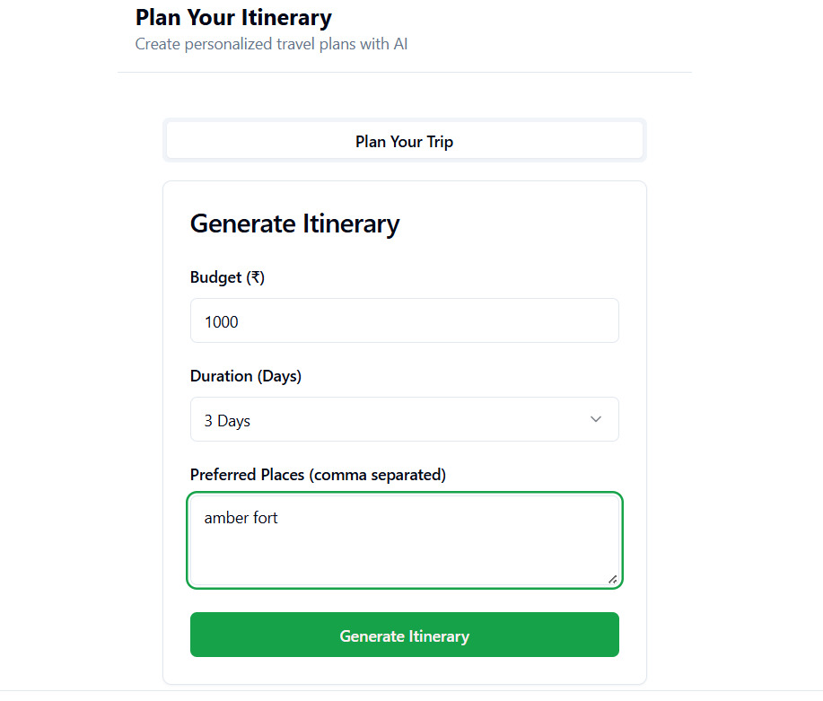
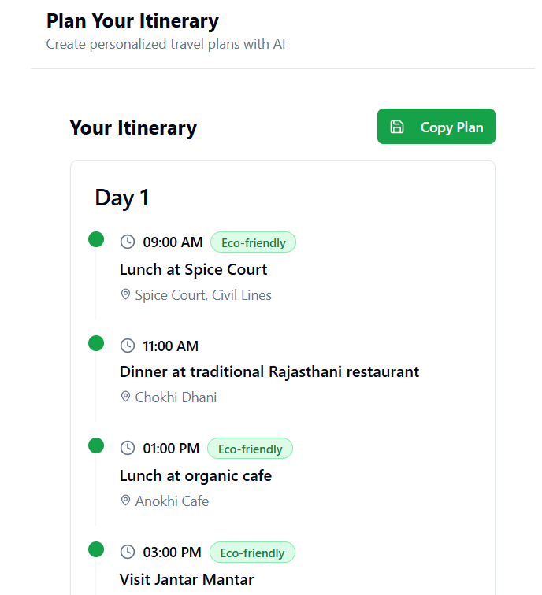
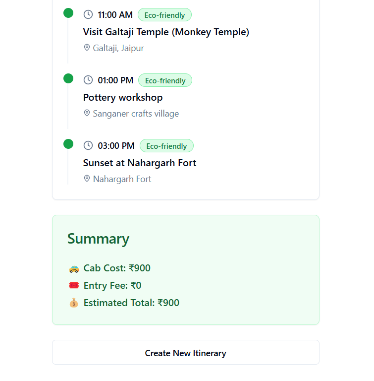

# 🧭 Travel Itinerary Generator

A full-stack web app that generates day-wise travel itineraries based on the user's time, budget, and preferred destinations — with estimated costs and eco-friendly suggestions.

---

## 🚀 Tech Stack

| Frontend  | Backend  |
|-----------|----------|
| React + Vite + Tailwind CSS | FastAPI (Python) |
| Axios for API calls | CORS Enabled REST API |
| shadcn/ui components | Pydantic + datetime for logic |

---

## ✨ Features

- 🔍 Input budget, duration, and 2–3 preferred places
- 📆 Generates a multi-day itinerary with:
  - Time slots
  - Activity and location names
  - Eco-friendly tags
  - Day-wise breakdown
- 💰 Cost summary: cab + entry fee + estimated total
- 🌿 Eco-friendly filter logic
- 💾 Copy or save the plan

---

## 📦 Folder Structure

root/ │ ├── frontend/ # React + Vite project │ └── backend/ # FastAPI server

yaml
Copy
Edit

---

## 🔧 How to Run the Project

### 1️⃣ Clone the Repo

```bash
git clone https://github.com/YOUR_USERNAME/travel-itinerary-generator.git
cd travel-itinerary-generator
2️⃣ Backend (FastAPI)
🐍 Requirements
Python 3.9+

pip

📦 Install Dependencies
bash
Copy
Edit
cd backend
pip install fastapi uvicorn
▶️ Run the API Server
bash
Copy
Edit
uvicorn main:app --reload
The backend will run on:
http://localhost:8000

You can test it in your browser at:
http://localhost:8000/docs

3️⃣ Frontend (React + Vite)
⚙️ Setup
bash
Copy
Edit
cd frontend
npm install
▶️ Run the Dev Server
bash
Copy
Edit
npm run dev
By default, it runs at:
http://localhost:5173

🔄 API Connection
Make sure the frontend is sending requests to the correct backend URL:

ts
Copy
Edit
axios.post("http://localhost:8000/generate-itinerary", payload);
To change the API base URL easily, use a .env file in frontend/:

env
Copy
Edit
VITE_API_URL=http://localhost:8000
Then access it using:

ts
Copy
Edit
import.meta.env.VITE_API_URL


Form Input	Day-wise Itinerary
💡 Future Improvements
🔍 Filter by crowd level or entry fee

📍 Map integration with Google Maps

📄 PDF/CSV export of itinerary

✨ User login + saved plans

```
📸 Screenshots

| 🧾 Input Form | 📅 Generated Itinerary |
|--------------|------------------------|
|  | <br> |
